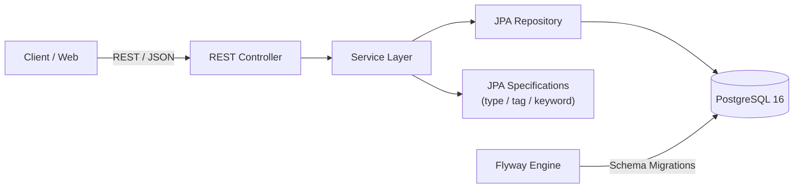

<div align="center">

  <h1>🚀 DevelopersHub</h1>
  <p><b>A unified backend platform for student developers to discover hackathons, internships, GSoC programs, and open-source opportunities.</b></p>

  <p>
    <a href="https://github.com/kunalbuilds-git/DevelopersHub">
      
    </a>
    <a href="https://github.com/kunalbuilds-git/DevelopersHub">
      
    </a>
    <a href="https://github.com/kunalbuilds-git/DevelopersHub">
      
    </a>
    <a href="https://github.com/kunalbuilds-git/DevelopersHub">
      
    </a>
    <a href="https://github.com/kunalbuilds-git/DevelopersHub">
      
    </a>
  </p>

  <p>
    <a href="https://github.com/kunalbuilds-git/DevelopersHub/blob/main/LICENSE">
      
    </a>
    
    <a href="https://github.com/kunalbuilds-git/DevelopersHub/milestone/1">
      
    </a>
  </p>

  <sub>Hand-crafted with JPA Specifications • Built feature-by-feature for deep learning</sub>

</div>

---

<p align="center">
  <a href="#about">About</a> •
  <a href="#features">Features</a> •
  <a href="#architecture">Architecture</a> •
  <a href="#tech-stack">Tech Stack</a> •
  <a href="#api-overview">API Overview</a> •
  <a href="#getting-started">Getting Started</a> •
  <a href="#project-structure">Structure</a>
</p>

---

## About

Student developers juggle hackathons, internships, GSoC-style programs, and beginner-friendly open-source issues scattered across a dozen different platforms. **DevelopersHub** brings them into one searchable, filterable hub — built both as a real tool and as a hands-on backend engineering project, one deliberate feature at a time.

---

## Features

### ✅ Currently Built
* **Full CRUD Lifecycle:** Create, read, update, and delete opportunities with strict payload validation and standard REST status codes.
* **Paginated Listings:** Dynamic page allocation featuring page index, size, total elements, and page metadata.
* **Normalized Tagging System:** Many-to-many relationship mapping (`opportunities` ↔ `tags`) via join tables with auto-creation for missing tags.
* **Composable Filtering:** Combined search across `type` and `tag` using Spring Data JPA Specifications instead of bloated repository queries.
* **Case-Insensitive Search:** Wildcard keyword search across titles and organization names.
* **Database Migrations:** Versioned, repeatable PostgreSQL schema migrations powered by Flyway.
* **Isolated Dev Setup:** Instant database setup via Docker Compose.

### 🚧 In Progress & Planned
* [ ] User Registration & Authentication (JWT-based)
* [ ] Role-Based Access Control (RBAC: Admin vs. User)
* [ ] Saved & Bookmarked Opportunities (sorted by deadline proximity)
* [ ] Continuous Integration pipeline with automated test suites
* [ ] React / Web Frontend
* [ ] Production Cloud Deployment

📌 Track real-time progress on the [v0.1 Milestone Board](https://github.com/kunalbuilds-git/DevelopersHub/milestones).

---

## Architecture



Designed following a clean multi-layered backend pattern (**Controller → Service → Repository**). Dynamic queries are composed at runtime using JPA Criteria Builders to maintain performance without cluttering repository interfaces.

---

## Tech Stack

| Component | Technology | Version | Description |
|---|---|---|---|
| **Language** | Java | 25 | Core platform language |
| **Framework** | Spring Boot | 4.1.1 | REST API framework & DI container |
| **Data Access** | Spring Data JPA | - | Object-Relational Mapping (Hibernate) |
| **Database** | PostgreSQL | 16 | Production-grade relational database |
| **Migrations** | Flyway | 12 | Database version control |
| **Build System** | Maven | 3.9+ | Dependency & build management |
| **Containerization** | Docker Compose | - | Local database orchestration |

---

## API Overview

**Base Path:** `/api/opportunities`

| Method | Endpoint | Query Parameters | Description |
|---|---|---|---|
| `GET` | `/` | `type`, `tag`, `keyword`, `page`, `size` | Fetch paginated & filtered opportunities |
| `GET` | `/{id}` | - | Fetch a single opportunity by ID |
| `POST` | `/` | - | Create a new opportunity (auto-links tags) |
| `PUT` | `/{id}` | - | Update an existing opportunity |
| `DELETE` | `/{id}` | - | Remove an opportunity by ID |

### 💡 Example Query

```http
GET /api/opportunities?type=program&tag=beginner-friendly&keyword=google&page=0&size=10
```

<details>
<summary><b>🔍 Click to view Sample JSON Response</b></summary>

```json
{
  "content": [
    {
      "id": 101,
      "title": "Google Summer of Code 2026",
      "organization": "Google",
      "type": "program",
      "url": "https://summerofcode.withgoogle.com",
      "tags": ["beginner-friendly", "open-source", "java"]
    }
  ],
  "pageable": {
    "pageNumber": 0,
    "pageSize": 10
  },
  "totalElements": 1,
  "totalPages": 1
}
```
</details>

---

## Getting Started

### Prerequisites
* **Java 25** installed locally (`java -version`)
* **Docker & Docker Compose** installed
* **Maven** (or use the provided `./mvnw` wrapper)

### Setup & Run

1. **Clone the repository**
   ```bash
   git clone https://github.com/kunalbuilds-git/DevelopersHub.git
   cd DevelopersHub
   ```

2. **Start the PostgreSQL Container**
   ```bash
   docker compose up -d
   ```

3. **Launch the Backend Service**
   ```bash
   cd backend
   ./mvnw spring-boot:run
   ```

4. **Verify Application Status**
   Access the base API at: `http://localhost:8080/api/opportunities`

---

## Project Structure

```
backend/
├── src/
│   ├── main/
│   │   ├── java/com/developershub/backend/
│   │   │   ├── controller/      # REST API Controllers
│   │   │   ├── service/         # Business Logic & Orchestration
│   │   │   ├── repository/      # Spring Data JPA Repositories
│   │   │   ├── specification/   # Composable JPA Query Filters
│   │   │   ├── entity/          # JPA Database Entities
│   │   │   └── dto/             # Request & Response Models
│   │   └── resources/
│   │       ├── db/migration/    # Flyway Migration SQL Scripts
│   │       └── application.yml  # Spring Application Configuration
└── docker-compose.yml           # Database container declaration
```

---

## Roadmap & Principles

Built as part of a publicly tracked software engineering journey (**#100DaysOfCode**). Every line of code, migration, and architecture decision is crafted by hand to foster genuine software engineering understanding rather than using AI boilerplate generation.

---

## Contributing

Currently developed as a solo project by [@kunalbuilds-git](https://github.com/kunalbuilds-git). Work is tracked against milestones via GitHub Issues. Suggestions and bug reports are welcome via [GitHub Issues](https://github.com/kunalbuilds-git/DevelopersHub/issues).

---

## License

This project is licensed under the [MIT License](LICENSE).
