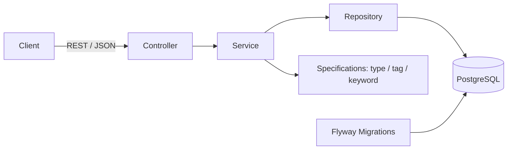

# DevelopersHub

> A developer-focused platform for discovering resources, projects, tools, and opportunities — all in one place.


## About

Student developers juggle hackathons, internships, GSoC-style programs, and beginner-friendly open-source issues scattered across a dozen different sites. DevelopersHub brings them into one searchable, filterable place — built both as a real tool and as a hands-on backend learning project, one feature at a time.

## Features

### Built
- Full CRUD for opportunities (create, read, update, delete) with validation and correct HTTP status codes
- Paginated listing with total count and page metadata
- Many-to-many tagging (opportunities ↔ tags) through a normalized join table
- Combined filtering by type and tag, built with Spring Data JPA Specifications
- Case-insensitive keyword search across title and organization
- Versioned schema migrations with Flyway
- Dockerized PostgreSQL for local development

### In progress / planned
- User registration and login with JWT
- Role-based access control (admin vs. regular user)
- Bookmarking / saved opportunities, sorted by deadline
- Automated tests running in CI on every pull request
- Frontend (web UI)
- Deployment

Live progress: [v0.1 milestone](https://github.com/kunalbuilds-git/DevelopersHub/milestones)

## Architecture



A layered Spring Boot backend — **Controller → Service → Repository** — with dynamic filtering handled through composable JPA Specifications instead of one query method per filter combination.

## Tech Stack

| Layer | Technology |
|---|---|
| Language | Java 25 |
| Framework | Spring Boot 4.1.1 |
| Data access | Spring Data JPA (Hibernate) |
| Database | PostgreSQL 16 |
| Migrations | Flyway |
| Build tool | Maven |
| Local dev | Docker Compose |

## API Overview

Base path: `/api/opportunities`

| Method | Endpoint | Description |
|---|---|---|
| `GET` | `/` | Paginated list, filterable by `type`, `tag`, `keyword` |
| `GET` | `/{id}` | Fetch a single opportunity |
| `POST` | `/` | Create an opportunity (new tags auto-created) |
| `PUT` | `/{id}` | Update an opportunity |
| `DELETE` | `/{id}` | Delete an opportunity |

Example:
```
GET /api/opportunities?type=program&tag=beginner-friendly&keyword=google&page=0&size=10
```

## Getting Started

**Prerequisites:** Java 25, Docker, Maven (or the included `mvnw` wrapper)

```bash
# 1. Start PostgreSQL
docker compose up -d

# 2. Run the backend
cd backend
./mvnw spring-boot:run
```

The API is then available at `http://localhost:8080/api/opportunities`.

## Project Structure

```
backend/
├── src/main/java/com/developershub/backend/
│   ├── controller/       # REST endpoints
│   ├── service/          # Business logic
│   ├── repository/       # Spring Data JPA repositories
│   ├── specification/    # Composable query filters
│   ├── entity/           # JPA entities
│   └── dto/              # API request/response shapes
└── src/main/resources/db/migration/   # Flyway migrations
```

## Roadmap

Built as part of a publicly-documented, year-long software engineering roadmap (#100DaysOfCode). Every feature here is hand-built rather than AI-generated, as a deliberate choice to build real understanding alongside the project.

## Contributing

Currently a solo project. Work is tracked against the `v0.1` milestone via GitHub Issues. Suggestions are welcome through Issues.

## License

MIT
