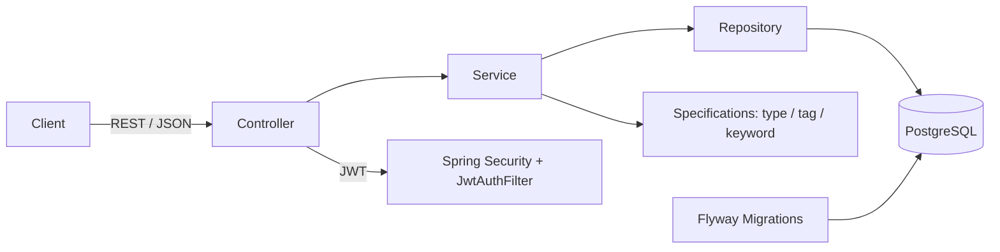

# DevelopersHub

> A developer-focused platform for discovering resources, projects, tools, and opportunities — all in one place.


## About

Student developers juggle hackathons, internships, GSoC-style programs, and beginner-friendly open-source issues scattered across a dozen different sites. DevelopersHub brings them into one searchable, filterable, personal place — built both as a real tool and as a hands-on backend learning project.

**v0.1 backend core is complete** — full CRUD, auth, role-based access, tagging, search, bookmarking, and CI, all hand-built and verified end-to-end.

## Features

- Full CRUD for opportunities (create, read, update, delete) with request validation and correct HTTP status codes
- Paginated listing with total count and page metadata (page size capped at 50)
- Many-to-many tagging (opportunities ↔ tags) through a normalized join table
- Combined filtering by type, tag, and keyword, built with Spring Data JPA Specifications
- Case-insensitive keyword search across title and organization, with LIKE wildcards escaped
- User registration and login with JWT authentication (BCrypt password hashing)
- Short-lived access tokens plus rotating, single-use refresh tokens with logout
- Role-based access control — only admins can create, edit, or delete opportunities
- One-time admin bootstrap so the first account can claim the ADMIN role without touching the database
- Sliding-window rate limiting on register, login, and bootstrap (429 with a per-IP budget)
- Any user can submit an opportunity; submissions stay hidden until an admin approves or rejects them
- Bookmark / unbookmark opportunities, with a personal saved list sorted by deadline
- Versioned schema migrations with Flyway, plus indexes on the filtered columns
- RFC 7807 ProblemDetail error responses for validation, conflicts, and bad input
- Dockerized PostgreSQL for local development
- Continuous integration — the test suite runs on every pull request and on pushes to main

### Planned next
- Frontend (web UI)
- Deployment

## Architecture


```mermaid
flowchart LR
    Client -->|REST / JSON| Controller
    Controller --> Service
    Service --> Repository
    Service --> Spec["Specifications: type / tag / keyword"]
    Controller -->|JWT| Security["Spring Security + JwtAuthFilter"]
    Repository --> DB[(PostgreSQL)]
    Flyway["Flyway Migrations"] --> DB
```

A layered Spring Boot backend — **Controller → Service → Repository** — with dynamic filtering through composable JPA Specifications and stateless JWT-based authentication.

## Tech Stack

| Layer | Technology |
|---|---|
| Language | Java 21 |
| Framework | Spring Boot 4.1.1 |
| Data access | Spring Data JPA (Hibernate) |
| Auth | Spring Security + JJWT |
| Database | PostgreSQL 16 |
| Migrations | Flyway |
| Build tool | Maven |
| Local dev | Docker Compose |
| CI | GitHub Actions |

## Local development

```bash
# 1. Start PostgreSQL
docker compose up -d

# 2. Run the API (from backend/)
cd backend
./mvnw spring-boot:run
```

The API listens on `http://localhost:8080`. Configuration is environment-driven, with development defaults baked in:

| Variable | Default | Purpose |
|---|---|---|
| `JWT_SECRET` | *(generated at startup)* | HMAC key for signing tokens. **Set this in production** — at least 32 bytes. Without it a random key is generated per restart, so tokens do not survive a restart. |
| `JWT_EXPIRATION_MS` | `1800000` (30 min) | Access-token lifetime. Short by design — the refresh token is the long-lived credential. |
| `REFRESH_TOKEN_EXPIRATION_DAYS` | `7` | Refresh-token lifetime in days. |
| `ADMIN_SETUP_TOKEN` | *(unset)* | One-time token that lets the first account claim ADMIN via `POST /api/auth/admin/bootstrap`. Unset disables the endpoint; it refuses to run once an admin exists. |
| `DB_URL` | `jdbc:postgresql://localhost:5432/developershub` | Database URL. |
| `DB_USERNAME` | `devuser` | Database user. |
| `DB_PASSWORD` | `devpass` | Database password. |
| `RATE_LIMIT_WINDOW_SECONDS` | `60` | Rate-limit window length. |
| `RATE_LIMIT_LOGIN_MAX` | `10` | Login attempts per IP per window. |
| `RATE_LIMIT_REGISTER_MAX` | `5` | Registration attempts per IP per window. |
| `RATE_LIMIT_BOOTSTRAP_MAX` | `3` | Bootstrap attempts per IP per window. |
| `CORS_ALLOWED_ORIGINS` | *(empty)* | Comma-separated browser origins allowed to call the API. Empty disables CORS. |

### Tests

```bash
cd backend
./mvnw test
```

Tests run against a dedicated `developershub_test` database, which is created automatically, so local development data is never touched. The suite covers authentication, role-based access, opportunity CRUD and filtering, bookmarks, and JWT handling.

## API Overview

**Opportunities** — `/api/opportunities`

| Method | Endpoint | Auth required |
|---|---|---|
| `GET` | `/` | No — filterable by `type`, `tag`, `keyword`, paginated. Only approved opportunities. |
| `GET` | `/{id}` | No |
| `POST` | `/` | Admin — created approved |
| `PUT` | `/{id}` | Admin |
| `DELETE` | `/{id}` | Admin |
| `POST` | `/submissions` | Logged-in user — creates a pending submission |
| `GET` | `/submissions` | Admin — the review queue, `?status=PENDING\|APPROVED\|REJECTED` |
| `POST` | `/submissions/{id}/approve` | Admin |
| `POST` | `/submissions/{id}/reject` | Admin |

**Auth** — `/api/auth`

| Method | Endpoint | Description |
|---|---|---|
| `POST` | `/register` | Create an account, returns an access token and a refresh token |
| `POST` | `/login` | Returns a fresh access token and refresh token |
| `POST` | `/refresh` | Exchange a refresh token for new tokens (single-use rotation) |
| `POST` | `/logout` | Revoke a refresh token |
| `POST` | `/admin/bootstrap` | Grant ADMIN to an existing account while no admin exists |

**Bookmarks** — `/api/bookmarks` (all require a logged-in user)

| Method | Endpoint | Description |
|---|---|---|
| `POST` | `/{opportunityId}` | Bookmark an opportunity |
| `DELETE` | `/{opportunityId}` | Remove a bookmark |
| `GET` | `/` | My saved opportunities, sorted by deadline |

### Opportunity types

`HACKATHON`, `INTERNSHIP`, `PROGRAM`, `OPEN_SOURCE` — any other value is rejected with `400`.

### Errors

Errors are returned as RFC 7807 ProblemDetail documents:

```json
{
  "type": "about:blank",
  "title": "Validation failed",
  "status": 400,
  "detail": "Validation failed",
  "errors": { "email": "must be a well-formed email address" }
}
```

| Status | When |
|---|---|
| `400` | Validation failure, malformed body, unknown opportunity type, bad parameter |
| `401` | Wrong credentials, or a token that is missing, expired, or invalid |
| `403` | Authenticated but not allowed (for example, a non-admin creating an opportunity) |
| `404` | Opportunity or bookmark does not exist — includes pending submissions, which are invisible to non-admins |
| `409` | Email already registered, opportunity already bookmarked, or a submission reviewed twice |
| `429` | Rate limit exceeded on register, login, or bootstrap |
| `503` | Admin bootstrap attempted while `ADMIN_SETUP_TOKEN` is not configured |

### Example

```bash
# Register (returns both tokens)
curl -X POST http://localhost:8080/api/auth/register \
  -H "Content-Type: application/json" \
  -d '{"email":"you@example.com","password":"Password123!"}'
# -> {"token":"...","refreshToken":"..."}

# Exchange a refresh token for a fresh pair (old refresh token is retired)
curl -X POST http://localhost:8080/api/auth/refresh \
  -H "Content-Type: application/json" \
  -d '{"refreshToken":"..."}'

# Create an opportunity as an admin
curl -X POST http://localhost:8080/api/opportunities \
  -H "Content-Type: application/json" \
  -H "Authorization: Bearer <token>" \
  -d '{"title":"Spring Boot Hackathon","organization":"DevelopersHub","type":"HACKATHON","description":"Build something","url":"https://example.com","deadline":"2026-12-31T23:59:00","tags":["java","backend"]}'

# Browse and filter (no auth needed)
curl "http://localhost:8080/api/opportunities?type=HACKATHON&tag=java&keyword=spring&page=0&size=10"

# Submit an opportunity as a regular user, then approve it as an admin
curl -X POST http://localhost:8080/api/opportunities/submissions \
  -H "Content-Type: application/json" \
  -H "Authorization: Bearer <user-token>" \
  -d '{"title":"Local OSS Meetup","organization":"Campus Club","type":"OPEN_SOURCE","description":"...","tags":["opensource"]}'
curl -X POST http://localhost:8080/api/opportunities/submissions/1/approve -H "Authorization: Bearer <admin-token>"
```

A listing looks like this:

```json
{
  "content": [
    {
      "id": 1,
      "title": "Spring Boot Hackathon",
      "organization": "DevelopersHub",
      "type": "HACKATHON",
      "description": "Build something",
      "url": "https://example.com",
      "deadline": "2026-12-31T23:59:00",
      "createdAt": "2026-10-28T17:13:26.807",
      "tags": [{ "id": 1, "name": "java" }]
    }
  ],
  "page": 0,
  "size": 10,
  "totalElements": 1,
  "totalPages": 1,
  "first": true,
  "last": true
}
```
